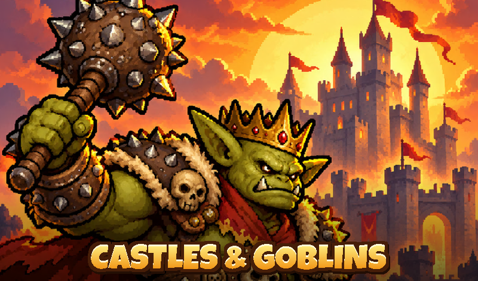

# Castles and Goblins

Мультяшная стратегия «защита башнями» (tower defense) на **Godot 4.3**: башни, герои, 16 уровней и финальная битва с Королём гоблинов.
A cartoon tower defense game made with **Godot 4.3** — towers, heroes, 16 levels and a final battle against the Goblin King.



## Возможности
- 3 вида башен (арбалет, казарма, маг), у каждой специализация на III уровне
- 3 героя и заклинание «Огненный шар»
- 8 видов гоблинов и босс с фазами
- бонусы между волнами, звёзды, прокачка за монеты, «Королевство»
- русский и английский язык (определяется автоматически)
- интеграция с SDK Яндекс Игр

## Запуск
1. Установите [Godot 4.3](https://godotengine.org/download) (стандартная версия, без .NET).
2. Откройте `project.godot` в редакторе и нажмите F5.

Управление: ЛКМ по месту у дороги — построить башню; по башне — улучшить или продать; 1–4 — герои и огненный шар; Пробел — вызвать волну; P — пауза; M — звук.

## Сборка для браузера и Яндекс Игр
1. В редакторе: **Editor → Manage Export Templates → Download and Install** (Godot 4.3).
2. **Project → Export → Web → Export Project**, путь `build/web/index.html`.
   Пресет уже настроен: без потоков (SharedArrayBuffer не нужен), своя HTML-оболочка `web/yandex_shell.html`.
3. Заархивируйте **содержимое** папки `build/web` (так, чтобы `index.html` был в корне архива) и загрузите архив в консоль разработчика Яндекс Игр.

Из командной строки:
```bash
godot --headless --export-release "Web" build/web/index.html
cd build/web && zip -r ../../castles-and-goblins-yandex.zip .
```

Сборку можно автоматически делать на GitHub: workflow `.github/workflows/build-web.yml` собирает web-версию и прикладывает zip для Яндекса к каждому запуску (вкладка Actions → артефакты).

## Как устроена интеграция с Яндекс Играми
- `web/yandex_shell.html` — HTML-оболочка: подключает `/sdk.js`, инициализирует `YaGames` до старта движка, запрещает контекстное меню, выделение и прокрутку страницы, следит за фокусом и видимостью вкладки.
- `scripts/platform_node.gd` (автозагрузка `Yandex`) — мост из игры:
  - язык — `environment.i18n.lang`;
  - `LoadingAPI.ready()` — когда показан главный экран;
  - `GameplayAPI.start()/stop()` — только во время боя (не на паузе, не в меню, не во время рекламы);
  - полноэкранная реклама — между боями (кнопки «Продолжить», «Повторить», «К уровням»), игра и звук на это время на паузе;
  - при потере фокуса звук выключается, бой ставится на паузу.
- Вне Яндекс Игр (локально, GitHub Pages) SDK не найден, и игра просто работает без него.

## Структура
```
assets/   графика, звуки, музыка
scenes/   сцены (заставка, выбор уровня, бой, улучшения)
scripts/  весь код игры
tests/    автотесты и скрипты скриншотов
web/      HTML-оболочка для браузера / Яндекс Игр
store/    иконка, обложка, скриншоты и тексты для каталога
```
